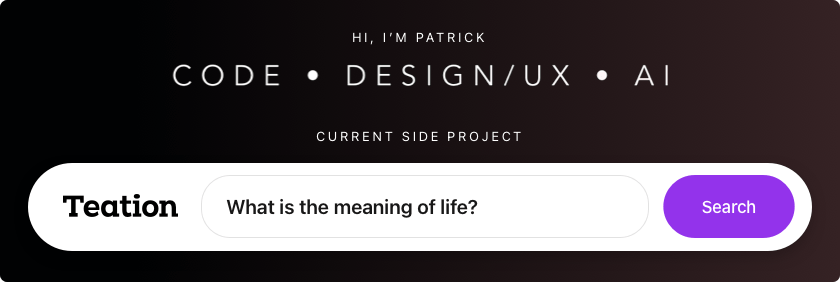

<!--

    Hi human!

    I admit, I did first start coding when websites were created using ,
    <markee>, and <blink> tags. Layouts were not coded with 
, flex and
    grid layouts. They were made with many <table> tags. Slowly these web
    standards changed. It was great. However emails lacked behind for a
    long long time. Eventually they started catching on — but here we
    are again. These markdown files rendered on GitHub are stripped
    of most of some tags and attributes: github.com/github/markup
    
    Ok. I get it. It needs to.

    I would like to embellish my profile. Add more interesting
    sections, interactions and information. However for now
    I'll need to limit the hackery. Going too far impedes
    on accessibility. This type of hacking also takes a
    lot of time and right now I have a dinner to cook.
    
    I will therefore say: 
        life can be difficult but
    take some time
        to appreciate the
        little things.
        A warm cup of coffee.
            Push some boundries.
            There are more strangers and
            friends that are willing to listen
        than you might think. Just ask. just ask
            just say hi
                then move on
        then say hi again
            and again.
                Some people will open up. 
                Some are just dealing with their own things
            or too focused. But some will open up.

    Send a Twitter message if you want :)

-->

### You can also find me here:

* Instagram: [patricknomad](//instagram.com/patricknomad)
* Twitter: [nomad_patrick](//twitter.com/nomad_patrick)
